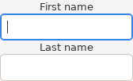
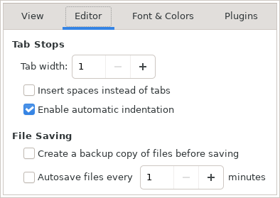

# gla11y: checking accessibility labelling of glade-based application user interfaces

Samuel Thibault, Hypra

When users employ a screen reader to navigate within an application user
interface, they need to perceive the context of the currently-focused
widget. For entries notably, they need to be sure what information
should be typed in which entry. Ideally, the very programmatic structure
of the user interface would be conveying this information, and be
exposed as such to screen readers. In practice however, the programmatic
structure expresses the layout of the visual rendering, which does not
necessarily match the semantic that should be perceived by the user.

In such a situation, explicit labelling is needed to provide the screen
reader with the correct context information to be presented to users.
The label would typically already be present in the user interface (for
sighted people to understand the context) but the relation between the
label and the focused widget is often only conveyed through visual
proximity only, and programmers are often unaware that an explicit relation
needs to be written for screen readers to express the relation for users
employing a screen reader.

Such missing relations can however be detected relatively accurately,
by tracking widgets which do not have context information, and labels
which have no relation with widgets. Simple detection heuristics applied
on the LibreOffice interface emit around 8 000 lines of warnings
over around 1 000 glade `.ui` files. Refining these
heuristics reduces this down to 2 000 lines of warnings, with very
few false positives and false negatives. This was assembled into the
gla11y tool, now integrated in the LibreOffice build infrastructure, thus
allowing LibreOffice programmers to automatically get compilation-time
warnings about missing relations and guarantee a level of accessibility
of the LibreOffice user interface.

This document describes the principles of the heuristics and can thus be
used as a guide for implementing the same kind of labelling checks over
other user interface frameworks.


## Labelling relations within user interfaces

Toolkits aimed at building graphical user interfaces commonly let programmers
express interfaces in a hierarchical way, employing for instance various
containers (vertical/horizontal stacking, grid, ...) to achieve the desired
visual layout. While this layout is meant to dispose interface elements for
a sighted user to understand their relations, the hierarchy often does not
actually match the actual semantic relation.  For instance, as shown below, a
vertical container can be used to alternate between labels and entries to be
filled by the user, each label being a description for the entry below. The
vertical container however does not actually express relations between labels
and entries. Screen readers would then have to *guess* them to be able to
provide the user with appropriate feedback for filling the form.



That is why explicit label-entry *relations* are introduced in such
situations, to provide the semantic relations. Quite often, these
labelling relations are already set by programmers for the *mnemonic*
functionality: one of the letters of the label is marked with e.g.
an underscore, and this defines a keyboard shortcut to switch the
keyboard focus to the related entry. Ideally all entries would have such
mnemonics; fixing missing labelling can actually end up in fixing missing
mnemonics, which will thus help not only screen readers, but also users
versed into keyboard shortcuts.

These relations are *transverse* to the hierarchical description
of the visual layout: they very often relate children of the same
container, but in some cases they relate widgets which are significantly
far apart in the hierarchy. Therefore, checking for missing relations
does not boil down to a trivial hierarchy traversal, the analysis has to
be conducted over the hierarchy, as described in the sections below.


## Basic principles

gla11y stands on a few basic principles.

* Some of the widgets of the interface are *labels* (In GTK, these are
`GtkLabel` and `GtkAccelLabel`.) i.e. they can be related with other widgets
(*label-for* / *labelled-by* relation) to convey context information for these
widgets, e.g. tell the user what information should be typed in an entry.

* Widgets should be labelled except in some cases. Containers and separators are
visible but not browseable by the user, and thus do not need context. Storage
widgets (e.g. `ListStore`, `TextBuffer`, `TreeSelection` are not browseable
either, and not visible anyway. Some other widgets are fully self-described,
such as status bars. Some widgets can already contain context information, for
instance through a tooltip or a placeholder.  Some widgets are integral part
of other widgets, and should thus be ignored; for instance, an image inside a
button should be ignored, since it is rather the button which should be given
the relation. An entry can also be the internal entry of another widget, and the
relation should be given to that widget.

* Some widgets require labelling i.e. a missing labelled-by relation should be
considered as a fatal error. For instance, entries, scales, spins and switches
do not contain context on their own, and screen readers would thus be unable to
provide any proper feedback to the user.

* Some widgets have their own labelling relation, for instance buttons can
already have a dedicated relation with their child label.

We call *orphan label* a label which is not related with any
widget.  We call *orphan widget* a widget which should be labelled
or requires labelling, but is not related with any label. To put it
briefly, gla11y traverses the hierarchy to look for orphan labels and
orphan widgets and warn about them.

Orphan labels are indeed a piece of information that the screen reader
will not know when to present to the user, and it is only in some rare
cases that the information is actually useless (i.e. the label is there
for pure cosmetic reasons).

Conversely, when orphan widgets get the keyboard focus, the screen
reader will have no context information to give to the user. This may
actually be expected in some situations where the context is obvious.
More precisely, when there is no orphan label in the rest of the
interface, it means that there is no piece of information that a sighted
user would see and relate with the orphan widgets, and thus the lack of
labelling is expected, and emitting a warning would be a false
positive. Warnings for orphan widgets should thus rather be emitted only
when also an orphan label is found in the interface. Interestingly, most
often that orphan label will indeed be what should be related with the
orphan widget. In the end in most cases the programmer will be faced
with a warning for an orphan label and a warning for an orphan widget,
and realize that they simply need to be related, making fixing labelling
a very efficient process.

The principle of gla11y was thus refined into traversing the hierarchy
to look for orphaned labels and orphan widgets, and then emitting warnings
for orphaned labels, and for orphan widgets if there are orphan labels.

## Restricting the scope of orphan labels and widgets

The mere presence of an orphan label will thus trigger warnings for
all orphan widgets in the interface. This may be way more verbose than
necessary. For instance, a dialog box can be composed of several pages. It does
not make sense to make a relation between a label and a widget on
different pages (a sighted user would not see them at the same time
anyway and would thus not make the connection either). An orphan label
should thus only trigger warnings for orphan widgets on the same page
only.

Even further, as shown below a dialog box page
may be composed of several labelled frames. Again, it does not make
sense to make a relation between a label and a widget contained in
different labelled frames. The orphan widget trigger scope can thus be
even limited to the labelled frame.



More generally, one can say that the orphan widget trigger scope can be
limited to any notion of *labelled container*. The fact that the
container is labelled means that the visual rendering will separate it
out from the rest of the interface, and thus the semantic of labelling
would not usually cross such container.

In other words, the principle of gla11y is here refined.  It warns about
orphan widgets only if there exists an orphan label within the same
labelled container.
This refinement strongly reduces the amount of warnings, we have seen
it very effective to avoid most false positives when checking the
LibreOffice interface, notably when a labelled frame contains an orphan label
whose purpose is only cosmetic, and another labelled frame contains an
orphan widget whose context is obvious.

## Checks

In addition to warning about orphan labels and orphan widgets, gla11y
warns about a few odd cases.

### Mutual relations

As mentioned above, in glade files the relation between a label and
a widget is a label-for / labelled-by mutual relation: the label has a
`label-for` attribute that contains the id of the widget, and the
widget has a `labelled-by` attribute that contains the id of the
label. gla11y will check that both attributes exist and are coherent.

Similarly, there are description-for / described-by relations, whose
coherency is also checked by gla11y.

### Multiple labels

A label can actually be labelling several widgets at the same time and
thus have several `label-for` attributes. A widget, however, can
not have several `labelled-by` attributes: the screen reader
would not know which one should be presented to the user. gla11y will warn
about such multiple labelling.

There is actually a situation where an interface would want to specify
two labels for the same widget: when some information should be provided
before the widget, and some information should be provided after the
widget. The bottom of the dialog box above provides an example: a
label on the left tells what kind of value is contained in the spin,
and a label on the right tells the unit of the value. The accessibility
stack does not currently provide a way to specify this.  The
label on the right will thus have to be left as an unfixable orphan
label warning for now.

### Multiple mnemonics

In the case of mnemonics, multiple labelling is actually not only an
accessibility bug, but also a keyboard shortcut bug. It would typically
come from a hasted copy/paste that missed fixing the referenced id. The
mnemonics of the labels would thus activate the same widget, and there
is probably another widget which is missing its mnemonic.

## Optimization

To make gla11y reasonably efficient (it has to parse the thousand
`.ui` files of LibreOffice in a reasonable time), we use
dictionaries to avoid parsing the hierarchy multiple times:

* For a given XML id, return the XML element.
* For a given XML id, return the list of objects which have a `labelled-by`
attribute referencing it.
* Similarly for the `label-for`, `mnemonic-for`, `described-by`, and
`description-for` attributes.

gla11y thus operates in two passes: it first traverses the hierarchy to
fill these dictionaries, and then traverses it again to look for orphan
labels and widgets and warn about them.

## Acceptance

Introducing a new code analysis tool comes with integration concerns. We
both want to make it present warnings to programmers as early as
possible in the development process (so accessibility issues get fixed
right at the time of their introduction), i.e. by using a static XML
file analysis at compilation time, but we also do not want to overwhelm
them. If the tool is too bothersome for programmers, they will start
ignoring it and the tool will have become counterproductive. That is why
the reduction of false positives described above was very important.
But this is also why the existing set of accessibility issues should
be managed with care. In the case of LibreOffice, gla11y was initially
emitting 2000 lines of warnings, we did not want to suddenly show them
all to programmers, they would just ignore them and not actually notice
when they introduce new ones.

### Suppression files

We have thus implemented a warning suppression file mechanism: gla11y
can be given a list of warnings that should not be printed. The idea
is that when gla11y was added to the build process of LibreOffice, we
also added the list of existing warnings in suppression files stored
along the source code. We thus started with a no-printed-warning state
(even if there were labelling issues to be fixed), so that programmers
would notice when they introduce *new* labelling issues on top of the
existing ones. Fixing the existing issues was then added as a background
janitorial task, the suppression files being cleared up progressively as
this task progresses.

The suppression format looks like this:

```
cui/uiconfig/ui/optgeneralpage.ui://GtkLabel[@id='toyear'] orphan-label
```

It consists of the `.ui` file name, an XPath-like expression, and
the type of warning. The concerned widget is purposely not identified by
its line number in the `.ui` file or by its exact path within the
XML syntax. The existing labelling issues are indeed not expected to be
fixed in the very close future, and thus the suppression files need to
be carried over interface revamping, which would of course change line
numbers, but also the interface hierarchy. In general the orphan labels
and widgets have an id, which can thus just be used to identify them in
a quite stable manner as shown above. In case they do not have an id, an
absolute XML path has to be used. In the case of LibreOffice, only 26
orphan label warnings had to be suppressed through such an absolute XML
path, we were able to suppress the other 2000 warnings through an id.

### Progressive introduction

Since gla11y was a new code analysis tool without previous use in the
wild, we were really cautious with the set of warnings that it would
print. We thus enabled its warnings only progressively, starting from
the ones which seemed very certain to us, and finishing with the ones
that might get false positives. We waited about two weeks between
enabling different sets of warnings, to leave time for programmers to
complain if they happened to be bothered by warnings. In the end we did
not get any complaint.

### False positives

In some cases, gla11y emits false positives, even if we took a lot of care
in filtering them out automatically as much as possible. In addition
to suppression files, we introduced false positive files, which follow
the same principles, except that these files are meant to remain as such
over time, unless gla11y gets better at avoiding them. Of course, adding
a warning to such a file must be done with a lot of care, checking that
there is really no underlying accessibility issue. LibreOffice currently
includes 80 of such false positives. These notably include widgets which
get labelling context during execution (because it is dynamic), or
labels whose visibility is dynamic.

### Widget classes to be ignored

gla11y has lists of widget classes that resp. do not need, should have, or
require labelling, which default to appropriate content according to the
stock GTK widgets. Callers of gla11y can add more classes to these lists,
to tune gla11y's behavior for application-provided widgets.

## Conclusion

Introducing a code analysis tool that produces warnings poses delicate
integration questions. Before adding gla11y to the build process of
LibreOffice, we took a lot of care to reduce the amount of false
positives, and we made sure through suppressions that the presence of
the existing issues would not overwhelm developers, so that we get a
*no-regression* principle: new issues have to be fixed promptly,
while existing issues can be fixed over time in the background.

## Acknowledgments

gla11y was developed by the Hypra company in the context of tender
\#201704-01 of The Document Foundation. We want to thank Martin Pieuchot
for the initial prototype and for coining the gla11y name.
